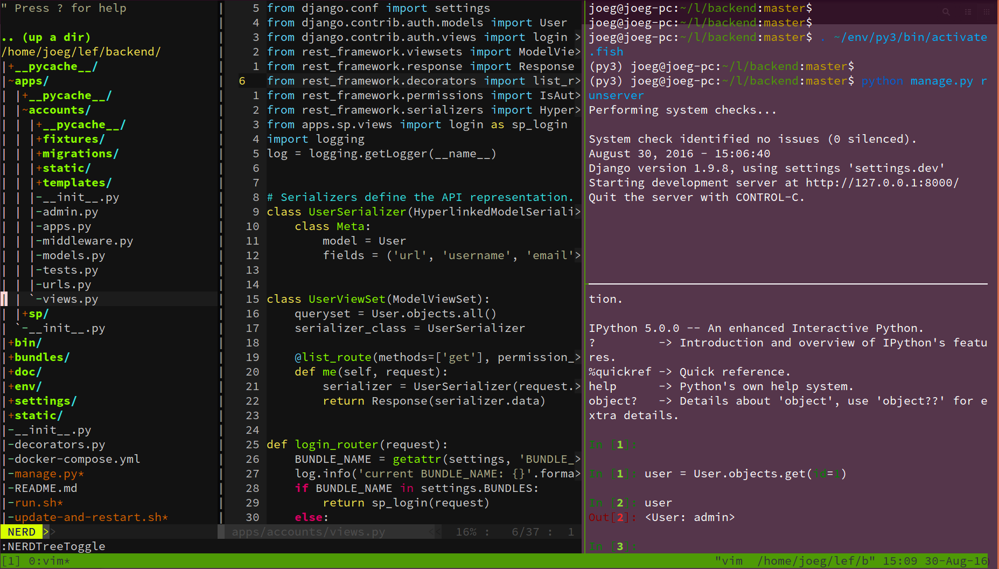

Title: tmux 配置笔记

## 背景

作为一名Python Web开发者，我的工作环境是Ubuntu + macOS. 我的核心工具链就三个：

- vim
- CLI
- Chrome

而这当中的前两个，都是在Terminal中.
因此我每天和Terminal打交道非常多, 经常被淹没在一大堆Terminal窗口和标签中.
这也是为什么我决定研究一下tmux来解决这个窗口太多的问题。

## tmux 简介
tmux是一个终端复用器(terminal multiplexer).
tmux有三个概念：会话(Session)，窗口(Window)，面板(Pane)。
如果你打开一个本地终端或者ssh到一个远程终端，你输入`tmux`，这时候你就建立了一个tmux`会话`。
在这个`会话`里，你默认拥有一个`窗口`, 并且可以创建更多`窗口`, 类似于浏览器里新Tab的意思。
而在每个`窗口`里，你可以分割出很多`面板`, 进行不同的任务。

因此，你可以通过tmux对同一个终端`会话`，实现`窗口`和`面板`两个层次的复用。

但是，tmux与vim非常类似：尽管功能强大，但是默认的配置非常不人性化，无法做到开箱即用，需要一些配置和定制才能真正提高生产力。
tmux的配置文件是`~/.tmux.conf`.

## 问题以及应对

### prefix
tmux默认的`prefix`是`Ctrl + b`, 就是说,默认情况下，大部分的操作，都要先按这两个键，再跟上其它快捷键，类似于Vim里的leader key.
不过问题是，这两个键相距较远，很难按到。于是很多人将prefix修改为`Ctrl + a`. 配置如下：

    set prefix C-a
    unbind C-b
    bind C-a send-prefix

不过，这样做也有副作用：`Ctrl + a` 在终端的作用是回到行首, 现在失效了。所以我个人没有采用这个配置。

### 修改配置并使其生效
你修改了`~/.tmux.conf`, 但是并没有起作用。你退出tmux, 重新进去，发现还是没有生效。
这是因为tmux后台有一个server, 在你第一次使用它时启动, 并创建`会话`。
当你退出时，它并没有退出。正确的方法杀掉server后再重新进入：

    tmux kill-server
    tmux

或者，重新加载配置文件：

    tmux srouce-file ~/.tmux.conf

即使如此，这依然很不方便。你可以使用如下配置：

    bind r source-file ~/.tmux.conf \; display "Reloaded!"

现在，你可以按`prefix + r`来重新加载你的配置文件。并且，在底部的状态栏上，会显示"Reloaded!"信息。

### bind和unbind命令
注意这里bind和unbind命令，分别是bind-key和unbind-key的别名。
我一开始看到不同的文档使用不同的命令非常困惑。查了官方文档才发现只是别名而已。
在这里为避免困惑，我一律使用更简短的bind以及unbind.

bind 不带选项时, 快捷键会绑定到prefix下。例如上面的`bind r source-file`。
`bind -n` 则表示绑定到全局，就是说你不用再按prefix了。
`bind -r` 表示这个按键可以重复，例如移动或者调整面板大小时就很有用。

### 修改默认shell
tmux里默认的shell是sh，非常基础，甚至连自动补全都没有。我而严重依赖于fish:

    set-option -g default-shell /usr/bin/fish

### 分割窗口
默认分割窗口的快捷键是：

    prefix + %: 水平分割
    prefix + ": 垂直分割

这两个快捷键非常难记，至少我是经常会搞错。你可以添加新的绑定：

    bind | split-window -h
    bind - split-window -v

这样，除了上面说的`%`和`"`, 你现在也可以用`|`和`-`来分别做水平分割和垂直分割，非常形象易懂。

### 在面板间移动
tmux将分割后的小窗口称为"面板(pane)". 在面板间移动的默认快捷键是`prefix + arrow`. 这虽然好记，可是并不方便。
接下来我们逐步改进这个很频繁的操作。

使用`prefix + [hjkl]`来移动：

    bind h select-pane -L
    bind j select-pane -D
    bind k select-pane -U
    bind l select-pane -R

现在，你可以使用vim的习惯，而不用把手移动到小键盘区的方向键了。但是，这依然需要使用prefix，效率很低。

在vim中, 我们也可以分割窗口. 我用来在窗口间移动的快捷键是`Ctrl + [hjkl]`, 已经习惯了，非常方便。
可不可以在tmux也使用同样的快捷键呢？ 答案是可以。配置如下：

    bind -n C-h select-pane -L
    bind -n C-j select-pane -D
    bind -n C-k select-pane -U
    bind -n C-l select-pane -R

到这里，这个方案似乎已经足够好。但是，它其实引入了新的问题:
当你像我上面的截图那样，在tmux的一个pane中打开vim并且试图在vim的分屏中移动时，
你会发现快捷键都被tmux截获了, vim的移动失效了。因为vim跑在tmux中。

我曾经打算接受现状，当需要在vim的分屏中移动时，使用`Ctrl + ww`, 把 `Ctrl + [hjkl]` 让给tmux.
但是要改变一个已经用了很多年的习惯，事实证明是非常困难的。

好在有这个困扰的不是我一个人，有一个vim插件解决了这个问题：

    https://github.com/christoomey/vim-tmux-navigator

这个插件首先在vim中增加了如下映射：

    <ctrl-h> => Left
    <ctrl-j> => Down
    <ctrl-k> => Up
    <ctrl-l> => Right
    <ctrl-\> => Previous split

这也意味着，你`vimrc`中自己做的映射现在不需要了。
不过，在`~/.tmux.conf`中，你要添加如下配置：

    is_vim="ps -o state= -o comm= -t '#{pane_tty}' | grep -iqE '^[^TXZ ]+ +(\\S+\\/)?g?(view|n?vim?x?)(diff)?$'"
    bind -n C-h if-shell "$is_vim" "send-keys C-h"  "select-pane -L"
    bind -n C-j if-shell "$is_vim" "send-keys C-j"  "select-pane -D"
    bind -n C-k if-shell "$is_vim" "send-keys C-k"  "select-pane -U"
    bind -n C-l if-shell "$is_vim" "send-keys C-l"  "select-pane -R"
    bind -n C-\ if-shell "$is_vim" "send-keys C-\\" "select-pane -l"

也就是当你按下`Ctrl + [hjkl]`时，tmux会判断你是想在vim里移动，还是在tmux里移动。
而且，当你试图从vim的split移动到tmux的pane时，它能够聪明的判断出来你的意图。

到这里，这个问题才算是完美解决。

### 改变面板大小
这里我直接使用默认的快捷键： `prefix + arrow`.
也就是你按下`Ctrl + b`后，仍然按住`Ctrl`, 同时可以重复按方向键来调整大小。
有些人同样喜欢将这里的方向键映射成vim的`[hjkl]`作为补充:

    bind -r C-k resizep -U 10
    bind -r C-j resizep -D 10
    bind -r C-h resizep -L 10
    bind -r C-l resizep -R 10

### 鼠标模式
tmux可以支持鼠标操作，只需要这样开启：

    set -g mouse on

现在你可以通过鼠标点击来切换pane，或者改变窗口的大小，还是挺方便的。
但是，新的问题随之出现：你发现你无法用鼠标选择文字并复制粘贴了。
尤其是我经常双击选中文字，用鼠标中键粘贴，简直上瘾。
由于有了上面的配置后，移动和改变大小的操作使用快捷键已经足够方便.
所以我决定放弃鼠标模式，以确保我仍然可以方便的使用复制粘贴。

### 复制模式
在tmux里，你也可以像在vim里那样，通过`[hjkl]`移动，选择文字，复制，粘贴。
但是整个操作需要通过一组快捷键：

- `prefix + [`进入复制模式
- `[hjkl]`移动到你想复制的文字开头
- `Space`开始选择, 像vim那样移动光标来选择
- `Enter`结束选择，复制选中的内容. 此时你已经退出了复制模式，光标回到命令行
- `prefix + ]` 粘贴

这里，tmux使用`Space`和`Enter`来进入和离开复制模式，与vim的习惯不一样，你可以做如下映射：

    # start selecting text typing 'v' key (once you are in copy mode)
    bind -t vi-copy 'v' begin-selection
    # copy selected text to the system's clipboard
    bind -t vi-copy 'y' copy-selection

现在你可以使用`v`和`y`来选择和复制了，更加vim-like.

但整体而言，个人觉得这个操作有点繁琐，我还是宁可使用鼠标进行复制粘贴操作。
